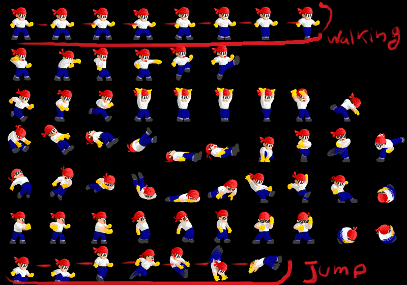

# ProjectFightingGame
This project was created by me as a JAVA final project during high school

### About

It was sopused to be a 2D sprite style fighting game, 
I took some SpriteSheets from the web, and tried to mimic the old 2D games i used to play,  
Part of the code which i was very proud of was the the sprite maker that i maneged to learn and implement in my code, 
Basically it would take a full SpriteSheet of a character and cut the specific image frames from it, 
Then it will put the cut out images in a HashMap Matrix, where each Key represents the action the charecter is going to make, 
During the game whenever the charector is walking or jumping or performing any other action,  
A diffrent string of frames would be looped thorugh and displayed on screen till the action is complete or interpreted. 

Saddly the project was too big for me and i didn't have enough knowledge and time to complete it on my own, 
Fortunately i got an A+ for implementing the sprite image slicer, 
Which was impressive as no one else did it and was way over the examiners expectations. 
I haven't touched the project since then and parts of it might be lost..:( 
